# **ubuntu2204 kubeadm安装k8s**

- **Master 节点**：10.0.0.10
- **Node1 节点**：10.0.0.11
- **Node2 节点**：10.0.0.12

### **第一阶段：基础环境准备（三台机器都要执行）**

**1. 关闭防火墙、Swap 并配置主机名**

```bash
# 关闭防火墙（生产环境建议按需开放端口，测试环境可直接关闭）

ufw disable

# 永久关闭 Swap 分区（K8s 要求必须关闭）

swapoff -a
sed -ri '/\sswap\s/s/^#?/#/' /etc/fstab

# 设置主机名（分别在对应的机器上执行）

hostnamectl set-hostname master  # 在 master 节点执行
hostnamectl set-hostname node1   # 在 node1 节点执行
hostnamectl set-hostname node2   # 在 node2 节点执行


# 配置 hosts 解析（三台机器都加上）

cat <<EOF | sudo tee -a /etc/hosts
10.0.0.10 master
10.0.0.11 node1
10.0.0.12 node2
EOF
```

**2. 配置内核转发及网桥过滤**

```bash
cat <<EOF | sudo tee /etc/modules-load.d/k8s.conf
br_netfilter
EOF

# 加载内核模块
modprobe br_netfilter

# 验证模块是否加载成功
ls /proc/sys/net/bridge/bridge-nf-call-iptables


cat <<EOF | sudo tee /etc/sysctl.d/k8s.conf
net.bridge.bridge-nf-call-ip6tables = 1
net.bridge.bridge-nf-call-iptables = 1
net.ipv4.ip_forward = 1
EOF

# 加载配置使其生效
sysctl --system
```

### **第二阶段：安装 Containerd 与 K8s 组件（三台机器都要执行）**

**1. 安装并配置 containerd**

```bash
# 安装 containerd
apt update && sudo apt install -y containerd

# 创建默认配置文件目录并生成默认配置
mkdir -p /etc/containerd
containerd config default | sudo tee /etc/containerd/config.toml

# 修改配置：将 SystemdCgroup 改为 true（与 K8s 的 cgroup 驱动保持一致）
sed -i 's/SystemdCgroup = false/SystemdCgroup = true/' /etc/containerd/config.toml

# 修改配置：更换沙箱镜像（pause 镜像）为国内阿里云源，防止拉取失败
sudo sed -i "s#registry.k8s.io/pause#registry.aliyuncs.com/google_containers/pause#g" /etc/containerd/config.toml

# 重启并开机自启 containerd
systemctl restart containerd
systemctl enable containerd
```

**2. 安装 kubeadm、kubelet 和 kubectl**

```bash
# 安装依赖
apt install -y apt-transport-https ca-certificates curl

# 添加阿里云 K8s 镜像源
curl -fsSL https://mirrors.aliyun.com/kubernetes/apt/doc/apt-key.gpg | sudo gpg --dearmor -o /etc/apt/keyrings/kubernetes-archive-keyring.gpg
echo "deb [signed-by=/etc/apt/keyrings/kubernetes-archive-keyring.gpg] https://mirrors.aliyun.com/kubernetes/apt/ kubernetes-xenial main" | sudo tee /etc/apt/sources.list.d/kubernetes.list

# 安装 K8s 组件
apt update
apt install -y kubelet kubeadm kubectl
apt-mark hold kubelet kubeadm kubectl
```

### **第三阶段：初始化 Master 节点（仅在 Master 机器执行）**

在 `master` 机器上执行初始化。注意：使用 containerd 时，**不需要**再加 `--cri-socket` 参数，kubeadm 会自动识别。

```bash
kubeadm init \
  --kubernetes-version=v1.28.2 \
  --pod-network-cidr=192.168.0.0/16 \
  --image-repository=registry.aliyuncs.com/google_containers
```

*(注：`--kubernetes-version` 请根据你实际安装的版本填写，可通过 `kubeadm version` 查看)*

**初始化成功后，终端会输出一段 `kubeadm join` 的命令，请务必复制保存下来！**

接着配置 `kubectl` 的访问权限：

```bash
mkdir -p $HOME/.kube
sudo cp -i /etc/kubernetes/admin.conf $HOME/.kube/config
sudo chown $(id -u):$(id -g) $HOME/.kube/config
```

### **第四阶段：加入工作节点与安装网络插件**

**1. 将 Node 节点加入集群（在 Node1 和 Node2 上执行）**
直接在两台工作节点上执行你在第三步保存的 `kubeadm join` 命令即可（使用 containerd 时，join 命令通常也不需要额外加 socket 参数）。它大概长这样：

```bash
kubeadm join 10.0.0.20:6443 --token y4r57m.4fr5hzvfvcl9qg60 \
	--discovery-token-ca-cert-hash sha256:955802b2321bc73f813f9abdb396af0e533c44570c84f3b73548c20f63f48290
```

**2. 安装 Calico 网络插件（在 Master 上执行）**

```bash
kubectl create -f https://raw.githubusercontent.com/projectcalico/calico/v3.26.1/manifests/tigera-operator.yaml
kubectl create -f https://raw.githubusercontent.com/projectcalico/calico/v3.26.1/manifests/custom-resources.yaml
```

### **验证集群状态**

```bash
kubectl get pod -A -o wide
```


### 扩展：安装nerdctl

```bash
# 1. 下载最新版的 nerdctl 完整版压缩包
wget https://github.com/containerd/nerdctl/releases/download/v2.1.2/nerdctl-full-2.1.2-linux-amd64.tar.gz

# 2. 将压缩包解压到 /usr/local 目录（会自动包含 containerd, runc, CNI 插件等）
tar Cxzvf /usr/local nerdctl-full-2.1.2-linux-amd64.tar.gz

# 3. 复制并启用 systemd 服务文件，确保 containerd 和 buildkit 能随系统启动
cp /usr/local/lib/systemd/system/*.service /etc/systemd/system/
systemctl enable --now containerd buildkit

# 4. 验证安装是否成功
nerdctl version
```

### 扩展：配置国内镜像加速

```bash
# 1.创建镜像仓库配置目录：
mkdir -p /etc/containerd/certs.d/docker.io/

# 2.创建并编辑 hosts.toml 配置文件：
vim /etc/containerd/certs.d/docker.io/hosts.toml

# 3. 在文件中填入以下内容并保存（这里使用的是目前可用的国内加速源）：
server = "https://docker.io"<websource>source_group_web_2</websource>

[host."https://docker.m.daocloud.io"]
  capabilities = ["pull", "resolve"]
  
# 4.重启 containerd 使配置生效：
systemctl restart containerd
```


### 扩展：containerd配置镜像加速

```bash
mkdir /etc/systemd/system/containerd.service.d/

vim /etc/systemd/system/containerd.service.d/http-proxy.conf
[Service]
Environment="HTTP_PROXY=http://10.0.0.1:7890"
Environment="HTTPS_PROXY=http://10.0.0.1:7890"
Environment="NO_PROXY=localhost,127.0.0.1,::1,10.0.0.0/8,172.16.0.0/12,192.168.0.0/16,192.168.1.100,192.168.1.101,192.168.1.102,.cluster.local,.svc"

systemctl restart containerd.service
```


## helm安装

```bash
curl https://raw.githubusercontent.com/helm/helm/main/scripts/get-helm-4 | bash
```


## 基于 nfs 创建 NFS 共享存储的storageclass

```bash
# 添加一块磁盘 sdb
# 先把新磁盘 sdb 分区、格式化，再挂载到 /mnt/data

# 创建分区
fdisk /dev/sdb
# 进入后按：
n
p
1


w

#说明：

n 新建分区
p 主分区
1 分区号
两次回车默认使用全部空间
w 保存退出

# 完成后会生成：/devsdb1

# ext4格式化
mkfs.ext4 /dev/sdb1

# 创建挂载目录
mkdir -p /mnt/data

# 开启开机自动挂载
# 获取 UUID
blkid /dev/sdb1
/dev/sdb1: UUID="4b25c303-8904-4bc8-86d0-f14e52be5c47" BLOCK_SIZE="4096" TYPE="ext4" PARTUUID="a11ff998-01"

vim /etc/fstab
# 添加到最后一行

UUID="4b25c303-8904-4bc8-86d0-f14e52be5c47"  /mnt/data  ext4  defaults  0  2

mount -a
```


```bash
# 创建NFS服务

# 在 nfs-server 节点上安装服务端
apt update && apt -y install nfs-server
echo '/mnt/data *(rw,no_root_squash)' >> /etc/exports

exportfs -r
exportfs -v


# 在所有nfs-client节点安装NFS客户端
apt update && apt -y install nfs-common 或者 nfs-client

#在master节点上
# 使用 Helm 安装 NFS CSI 驱动（推荐）
helm repo add csi-driver-nfs https://raw.githubusercontent.com/kubernetes-csi/csi-driver-nfs/master/charts
helm install csi-driver-nfs csi-driver-nfs/csi-driver-nfs --namespace kube-system

# 创建一个 nfs-sc.yaml 文件，内容如下：
apiVersion: storage.k8s.io/v1
kind: StorageClass
metadata:
  name: nfs-csi  # 存储类的名字，PVC 会通过这个名字来点单
provisioner: nfs.csi.k8s.io  # 指定由刚才安装的 NFS CSI 驱动来处理
parameters:
  server: 10.0.0.250  # 你的 NFS 服务器 IP
  share: /mnt/data    # NFS 上的基础共享目录（驱动会在里面自动建子目录）
reclaimPolicy: Delete  # PVC 删除时，自动清理后端的 PV 和数据
volumeBindingMode: Immediate  # 立即绑定模式


# 创建这个存储类
kubectl apply -f nfs-sc.yaml
```


## helm部署openEBS

最少3个node

```bash
# 添加仓库
helm repo add openebs https://openebs.github.io/openebs

# 部署
helm upgrade openebs --install --namespace openebs openebs/openebs --set engines.replicated.mayastor.enabled=false \
            --set engines.local.zfs.enabled=false --set engines.local.lvm.enabled=false --create-namespace
```


## helm 安装ingress nginx

```bash
# 添加官方仓库
helm repo add ingress-nginx https://kubernetes.github.io/ingress-nginx
# 更新仓库信息
helm repo update
# 创建名称空间
kubectl create namespace ingress-nginx
# 使用helm安装
helm install ingress-nginx ingress-nginx/ingress-nginx \
  --namespace ingress-nginx \
  --set controller.service.type=LoadBalancer \
  --set controller.admissionWebhooks.enabled=false
```


## helm 安装metalLB

```bash
# 前置准备：开启 strictARP
# 1.编辑 kube-proxy 的 ConfigMap：
kubectl edit configmap -n kube-system kube-proxy

# 2. 在编辑器中找到 mode 和 strictARP 字段，修改如下：
kind: KubeProxyConfiguration
mode: "ipvs"  # 确保 mode 是 "ipvs"
ipvs:
  strictARP: true  # 必须设置为 true
  
# 3.保存退出后，重启 kube-proxy 使配置生效：
kubectl rollout restart daemonset kube-proxy -n kube-system


# 使用 Helm 部署 MetalLB
helm repo add metallb https://metallb.github.io/metallb
helm repo update

kubectl create namespace metallb-system

helm install metallb metallb/metallb -n metallb-system


# 配置ip地址池

apiVersion: metallb.io/v1beta1
kind: IPAddressPool
metadata:
  name: first-pool
  namespace: metallb-system
spec:
  addresses:
  # 替换成你局域网中可用的IP地址段，例如：
  - 10.0.0.200-20.0.0.250
---
apiVersion: metallb.io/v1beta1
kind: L2Advertisement
metadata:
  name: example
  namespace: metallb-system
```


## kuboard安装

```bash
# kuboard.yaml 文件，基于 nfs 创建 NFS 共享存储的storageclass
---
apiVersion: v1
kind: Namespace
metadata:
  name: kuboard

---
apiVersion: v1
kind: ConfigMap
metadata:
  name: kuboard-v3-config
  namespace: kuboard
data:
  # 关于如下参数的解释，请参考文档 https://kuboard.cn/install/v3/install-built-in.html
  # [common]
  KUBOARD_ENDPOINT: 'http://kuboard.magedu.com'
  KUBOARD_AGENT_SERVER_UDP_PORT: '30081'
  KUBOARD_AGENT_SERVER_TCP_PORT: '30081'
  KUBOARD_SERVER_LOGRUS_LEVEL: info  # error / debug / trace
  # KUBOARD_AGENT_KEY 是 Agent 与 Kuboard 通信时的密钥，请修改为一个任意的包含字母、数字的32位字符串，此密钥变更后，需要删除 Kuboard Agent 重新导入。
  KUBOARD_AGENT_KEY: 32b7d6572c6255211b4eec9009e4a816  

  # 关于如下参数的解释，请参考文档 https://kuboard.cn/install/v3/install-gitlab.html
  # [gitlab login]
  # KUBOARD_LOGIN_TYPE: "gitlab"
  # KUBOARD_ROOT_USER: "your-user-name-in-gitlab"
  # GITLAB_BASE_URL: "http://gitlab.mycompany.com"
  # GITLAB_APPLICATION_ID: "7c10882aa46810a0402d17c66103894ac5e43d6130b81c17f7f2d8ae182040b5"
  # GITLAB_CLIENT_SECRET: "77c149bd3a4b6870bffa1a1afaf37cba28a1817f4cf518699065f5a8fe958889"
  
  # 关于如下参数的解释，请参考文档 https://kuboard.cn/install/v3/install-github.html
  # [github login]
  # KUBOARD_LOGIN_TYPE: "github"
  # KUBOARD_ROOT_USER: "your-user-name-in-github"
  # GITHUB_CLIENT_ID: "17577d45e4de7dad88e0"
  # GITHUB_CLIENT_SECRET: "ff738553a8c7e9ad39569c8d02c1d85ec19115a7"

  # 关于如下参数的解释，请参考文档 https://kuboard.cn/install/v3/install-ldap.html
  # [ldap login]
  # KUBOARD_LOGIN_TYPE: "ldap"
  # KUBOARD_ROOT_USER: "your-user-name-in-ldap"
  # LDAP_HOST: "ldap-ip-address:389"
  # LDAP_BIND_DN: "cn=admin,dc=example,dc=org"
  # LDAP_BIND_PASSWORD: "admin"
  # LDAP_BASE_DN: "dc=example,dc=org"
  # LDAP_FILTER: "(objectClass=posixAccount)"
  # LDAP_ID_ATTRIBUTE: "uid"
  # LDAP_USER_NAME_ATTRIBUTE: "uid"
  # LDAP_EMAIL_ATTRIBUTE: "mail"
  # LDAP_DISPLAY_NAME_ATTRIBUTE: "cn"
  # LDAP_GROUP_SEARCH_BASE_DN: "dc=example,dc=org"
  # LDAP_GROUP_SEARCH_FILTER: "(objectClass=posixGroup)"
  # LDAP_USER_MACHER_USER_ATTRIBUTE: "gidNumber"
  # LDAP_USER_MACHER_GROUP_ATTRIBUTE: "gidNumber"
  # LDAP_GROUP_NAME_ATTRIBUTE: "cn"

---
apiVersion: apps/v1
kind: StatefulSet
metadata:
  name: kuboard-etcd
  namespace: kuboard
  labels:
    app: kuboard-etcd
spec:
  serviceName: kuboard-etcd
  replicas: 3
  selector:
    matchLabels:
      app: kuboard-etcd
  template:
    metadata:
      name: kuboard-etcd
      labels:
        app: kuboard-etcd
    spec:
      containers:
      - name: kuboard-etcd
        image: eipwork/etcd:v3.4.14
        ports:
        - containerPort: 2379
          name: client
        - containerPort: 2380
          name: peer
        env:
        - name: KUBOARD_ETCD_ENDPOINTS
          value: >-
            kuboard-etcd-0.kuboard-etcd:2379,kuboard-etcd-1.kuboard-etcd:2379,kuboard-etcd-2.kuboard-etcd:2379
        volumeMounts:
        - name: data
          mountPath: /data
        command:
          - /bin/sh
          - -c
          - |
            PEERS="kuboard-etcd-0=http://kuboard-etcd-0.kuboard-etcd:2380,kuboard-etcd-1=http://kuboard-etcd-1.kuboard-etcd:2380,kuboard-etcd-2=http://kuboard-etcd-2.kuboard-etcd:2380"
            exec etcd --name ${HOSTNAME} \
              --listen-peer-urls http://0.0.0.0:2380 \
              --listen-client-urls http://0.0.0.0:2379 \
              --advertise-client-urls http://${HOSTNAME}.kuboard-etcd:2379 \
              --initial-advertise-peer-urls http://${HOSTNAME}:2380 \
              --initial-cluster-token kuboard-etcd-cluster-1 \
              --initial-cluster ${PEERS} \
              --initial-cluster-state new \
              --data-dir /data/kuboard.etcd
  volumeClaimTemplates:
  - metadata:
      name: data
    spec:
      # 请填写一个有效的 StorageClass name
      storageClassName: nfs-csi
      accessModes: [ "ReadWriteMany" ]
      resources:
        requests:
          storage: 5Gi


---
apiVersion: v1
kind: PersistentVolumeClaim
metadata:
  name: kuboard-data-pvc
  namespace: kuboard
spec:
  storageClassName: nfs-csi
  accessModes:
    - ReadWriteOnce
  resources:
    requests:
      storage: 10Gi

---
apiVersion: v1
kind: Service
metadata:
  name: kuboard-etcd
  namespace: kuboard
spec:
  type: ClusterIP
  ports:
  - port: 2379
    name: client
  - port: 2380
    name: peer
  selector:
    app: kuboard-etcd

---
apiVersion: apps/v1
kind: Deployment
metadata:
  annotations:
    deployment.kubernetes.io/revision: '9'
    k8s.kuboard.cn/ingress: 'false'
    k8s.kuboard.cn/service: NodePort
    k8s.kuboard.cn/workload: kuboard-v3
  labels:
    k8s.kuboard.cn/name: kuboard-v3
  name: kuboard-v3
  namespace: kuboard
spec:
  replicas: 1
  selector:
    matchLabels:
      k8s.kuboard.cn/name: kuboard-v3
  template:
    metadata:
      labels:
        k8s.kuboard.cn/name: kuboard-v3
    spec:
      containers:
        - env:
            - name: KUBOARD_ETCD_ENDPOINTS
              value: >-
                kuboard-etcd-0.kuboard-etcd:2379,kuboard-etcd-1.kuboard-etcd:2379,kuboard-etcd-2.kuboard-etcd:2379
          envFrom:
            - configMapRef:
                name: kuboard-v3-config
          image: 'eipwork/kuboard:v3'
          imagePullPolicy: Always
          name: kuboard
          volumeMounts:
            - mountPath: "/data"
              name: kuboard-data
      volumes:
      - name: kuboard-data
        persistentVolumeClaim:
          claimName: kuboard-data-pvc

---
apiVersion: v1
kind: Service
metadata:
  annotations:
    k8s.kuboard.cn/workload: kuboard-v3
  labels:
    k8s.kuboard.cn/name: kuboard-v3
  name: kuboard-v3
  namespace: kuboard
spec:
  ports:
    - name: webui
      nodePort: 30080
      port: 80
      protocol: TCP
      targetPort: 80
    - name: agentservertcp
      nodePort: 30081
      port: 10081
      protocol: TCP
      targetPort: 10081
    - name: agentserverudp
      nodePort: 30081
      port: 10081
      protocol: UDP
      targetPort: 10081
  selector:
    k8s.kuboard.cn/name: kuboard-v3
  sessionAffinity: None
  type: NodePort


kubectl apply -f kuboard.yaml

# 安装 metrics-server
kubectl apply -f https://addons.kuboard.cn/metrics-server/0.3.7/metrics-server.yaml

# 给 kuboard 配置 ingress

apiVersion: networking.k8s.io/v1
kind: Ingress
metadata:
  name: kuboard-v3
  namespace: kuboard
spec:
  ingressClassName: nginx
  rules:
  - host: kuboard.kang.com
    http:
      paths:
      - path: /
        backend:
          service:
            name: kuboard-v3
            port:
              number: 80
        pathType: Prefix

kubectl apply -f kuboard-ingress.yaml

# 创建Token
cat << EOF > kuboard-create-token.yaml
---
apiVersion: v1
kind: Namespace
metadata:
  name: kuboard

---
apiVersion: v1
kind: ServiceAccount
metadata:
  name: kuboard-admin
  namespace: kuboard

---
apiVersion: rbac.authorization.k8s.io/v1
kind: ClusterRoleBinding
metadata:
  name: kuboard-admin-crb
roleRef:
  apiGroup: rbac.authorization.k8s.io
  kind: ClusterRole
  name: cluster-admin
subjects:
- kind: ServiceAccount
  name: kuboard-admin
  namespace: kuboard

---
apiVersion: v1
kind: Secret
type: kubernetes.io/service-account-token
metadata:
  annotations:
    kubernetes.io/service-account.name: kuboard-admin
  name: kuboard-admin-token
  namespace: kuboard
EOF

kubectl apply -f kuboard-create-token.yaml 

#获取token

echo -e "\033[1;34m将下面这一行红色输出结果填入到 kuboard 界面的 Token 字段：\033[0m"
echo -e "\033[31m$(kubectl -n kuboard get secret $(kubectl -n kuboard get secret kuboard-admin-token | grep kuboard-admin-token | awk '{print $1}') -o go-template='{{.data.token}}' | base64 -d)\033[0m"

```


## helm部署harbor

```bash
helm repo add harbor https://helm.goharbor.io

helm repo update

vim harbor-values.yaml

expose:
  # 配置暴露服务的方式为 Ingress
  type: ingress
  tls:
    enabled: true  # 启用 TLS 加密
    certSource: auto  # 自动生成证书（由 Ingress Controller 或 cert-manager 提供）
  ingress:
    hosts:
      core: harbor.kang.com  # 配置主机名，用户通过此域名访问 Harbor
    className: "nginx"  # 使用 Nginx Ingress Controller 来处理流量
    annotations:
      # 配置 Ingress 的 SSL 重定向和代理请求体大小限制
      ingress.kubernetes.io/ssl-redirect: "true"  # 自动将 HTTP 请求重定向到 HTTPS
      ingress.kubernetes.io/proxy-body-size: "0"  # 禁用请求体大小限制
      nginx.ingress.kubernetes.io/ssl-redirect: "true"  # Nginx 特定的 SSL 重定向设置
      nginx.ingress.kubernetes.io/proxy-body-size: "0"  # Nginx 特定的代理请求体大小设置

# 配置 IP 家族支持
ipFamily:
  ipv4:
    enabled: true  # 启用 IPv4
  ipv6:
    enabled: false  # 禁用 IPv6

# 设置 Harbor 外部访问的 URL 地址
externalURL: https://harbor.kang.com

# 持久化存储配置部分
persistence:
  enabled: true  # 启用持久化存储
  resourcePolicy: "keep"  # 在删除 Harbor 时保留存储卷
  persistentVolumeClaim:  # 定义 Harbor 各个组件的 PVC（持久卷）
    registry:  # 配置 registry 组件的 PVC
      storageClass: "nfs-csi"  # 使用 NFS 存储类
      accessMode: ReadWriteMany  # 存储访问模式，支持多个 Pod 同时读写
      size: 5Gi  # 存储大小为 5Gi
    chartmuseum:  # 配置 chartmuseum 组件的 PVC
      storageClass: "nfs-csi"  # 使用 NFS 存储类
      accessMode: ReadWriteMany  # 存储访问模式，支持多个 Pod 同时读写
      size: 5Gi  # 存储大小为 5Gi
    jobservice:  # 配置 jobservice 组件的 PVC
      jobLog:
        storageClass: "nfs-csi"  # 使用 NFS 存储类
        accessMode: ReadWriteOnce  # 存储访问模式，仅支持一个 Pod 读写
        size: 1Gi  # 存储大小为 1Gi
      # scanDataExports:
      #   storageClass: "nfs-csi"  # 可选项：扫描数据导出 PVC 配置
      #   accessMode: ReadWriteOnce  # 存储访问模式，仅支持一个 Pod 读写
      #   size: 1Gi  # 存储大小为 1Gi
    database:  # 配置 PostgreSQL 数据库组件的 PVC
      storageClass: "nfs-csi"  # 使用 NFS 存储类
      accessMode: ReadWriteMany  # 存储访问模式，支持多个 Pod 同时读写
      size: 2Gi  # 存储大小为 2Gi
    redis:  # 配置 Redis 缓存组件的 PVC
      storageClass: "nfs-csi"  # 使用 NFS 存储类
      accessMode: ReadWriteMany  # 存储访问模式，支持多个 Pod 同时读写
      size: 2Gi  # 存储大小为 2Gi
    trivy:  # 配置 Trivy 漏洞扫描组件的 PVC
      storageClass: "nfs-csi"  # 使用 NFS 存储类
      accessMode: ReadWriteMany  # 存储访问模式，支持多个 Pod 同时读写
      size: 5Gi  # 存储大小为 5Gi

# 设置 Harbor 管理员密码
harborAdminPassword: "Harbor123"


helm install harbor -f harbor-values.yaml harbor/harbor -n harbor --create-namespace
```

```bash
# 注意要关闭代理，要不会把域名代理出去

# 登录
nerdctl login harbor.kang.com --insecure-registry

# 修改 tag
nerdctl tag crpi-3ui7iibgz56vc6mp.cn-hangzhou.personal.cr.aliyuncs.com/zokang/vscode-notebook:v1.0 harbor.kang.com/library/vscode-notebook:v1.0

# 从 harbor 导出证书
mkdir -p /etc/containerd/certs.d/harbor.kang.com
cd /etc/containerd/certs.d/harbor.kang.com
ls

ca.crt


# 推送push
nerdctl push harbor.kang.com/library/vscode-notebook:v1.0

```


# ubuntu2204 kubespray安装k8s

```
master 10.0.0.30
node 10.0.0.31
node 10.0.0.32
```

官网地址

```url
https://imroc.cc/kubernetes/deploy/kubespray/install
```

## 1、配置 Kubespray 节点

```bash
$ apt update
$ apt install git python3 python3-pip -y
$ apt-get install python3-netaddr
$ apt install -y python3.10-venv
$ git clone --depth=1 https://github.com/kubernetes-sigs/kubespray.git /opt/kubespray
$ cd kubespray
#如果有旧版本(卸载)
$ pip3 uninstall ansible-core ansible -y

# 创建 Python 虚拟环境(以后所有命令都在 venv 里执行)
$ python3 -m venv venv
$ ls venv/bin/
activate       activate.csh   activate.fish  Activate.ps1   pip            pip3           pip3.10        python         python3        python3.10

$ source venv/bin/activate

$ pip install --upgrade pip

$ pip install ansible-core==2.15.8

$ ansible --version
ansible [core 2.15.8]
  config file = /opt/kubespray/ansible.cfg
  configured module search path = ['/opt/kubespray/library']
  ansible python module location = /opt/kubespray/venv/lib/python3.10/site-packages/ansible
  ansible collection location = /root/.ansible/collections:/usr/share/ansible/collections
  executable location = /opt/kubespray/venv/bin/ansible
  python version = 3.10.12 (main, Mar  3 2026, 11:56:32) [GCC 11.4.0] (/opt/kubespray/venv/bin/python3)
  jinja version = 3.1.6
  libyaml = True

# 安装 Kubespray Python 依赖
$ pip install -r requirements.txt

# 安装兼容的 collection
$ ansible-galaxy collection install ansible.posix:1.5.4

$ ansible-galaxy collection install community.general:7.5.0

$ ansible-galaxy collection install kubernetes.core:2.4.0


$ ansible-galaxy collection list

# 确认至少有：
ansible.posix
community.general
kubernetes.core
```

**主机清单，运行以下命令，不要忘记替换适合你部署的 IP 地址：**

```bash
$ cp -rfp inventory/sample inventory/mycluster

$ vim inventory/mycluster/inventory.ini

# This inventory describe a HA typology with stacked etcd (== same nodes as control plane)
# and 3 worker nodes
# See https://docs.ansible.com/ansible/latest/inventory_guide/intro_inventory.html
# for tips on building your # inventory

# Configure 'ip' variable to bind kubernetes services on a different ip than the default iface
# We should set etcd_member_name for etcd cluster. The node that are not etcd members do not need to set the value,
# or can set the empty string value.

[all]
master1 ansible_host=10.0.0.30
node1 ansible_host=10.0.0.31 
node2 ansible_host=10.0.0.32  

[kube_control_plane]
master1

[etcd]
master1

[kube_node]
master1
node1
node2

[calico_rr]

[k8s_cluster:children]
kube_control_plane
kube_node
calico_rr
```

```bash
$ vim inventory/mycluster/group_vars/k8s_cluster/k8s-cluster.yml

kube_version: v1.26.2
kube_network_plugin: calico
kube_pods_subnet: 10.233.64.0/18
kube_service_addresses: 10.233.0.0/18
# 支持 docker, crio 和 containerd，推荐 containerd.
container_manager: containerd

# 是否开启 kata containers
kata_containers_enabled: false
# 是否开启自动更新证书，推荐开启。
auto_renew_certificates: true
```

要启用 Kuberenetes 仪表板和入口控制器等插件，请在文件 `inventory/mycluster/group_vars/k8s_cluster/addons.yml` 中将参数设置为已启用：（选择修改）

```bash
$ vi inventory/mycluster/group_vars/k8s_cluster/addons.yml
dashboard_enabled: true
ingress_nginx_enabled: true
ingress_nginx_host_network: true
```

编辑 `inventory/mycluster/group_vars/all/all.yml` 或其他对应的变量文件，取消注释并设置有效的上游 DNS 服务器，比如：（选则修改）

```bash
upstream_dns_servers:
  - 8.8.8.8
  - 8.8.4.4
  
  
  
如需vip高可用如下配置

kube_vip_enable: false      # 设置为 false，表示使用 keepalived+haproxy，而不是 kube-vip
loadbalancer_apiserver_localhost: false
deploy_netchecker: false


haproxy_loadbalancer:
  enabled: true
  nodes:
    - name: genbo-master-001
      ip: 10.0.20.1
    - name: genbo-master-002
      ip: 10.0.20.2
    - name: genbo-master-003
      ip: 10.0.20.3
  port: 6443

keepalived_enabled: true
keepalived_vip_interface: "eth0"      # 按实际网卡修改
keepalived_vip_cidr: "24"
keepalived_vip_address: "10.0.20.100"
```

修改roles/kubernetes/preinstall/tasks/0070-system-packages.yml （DNS相关python锁连接问题修改）

```yaml
- name: Update package management cache (APT)
  apt:
    update_cache: yes
    cache_valid_time: 3600
  when: ansible_os_family == "Debian"
  tags:
    - bootstrap-os
  register: apt_update
  until: apt_update is succeeded
  retries: 5
  delay: 10
```


## 2、配置ssh免密登录

```bash
$ ssh-keygen
 
$ ssh-copy-id root@10.0.0.30
$ ssh-copy-id root@10.0.0.31
$ ssh-copy-id root@10.0.0.32
```

## 3、**禁用防火墙并启用 IPV4 转发**

要在所有节点上禁用防火墙，请从 Ansible 节点运行以下 `ansible` 命令:

```bash
# centos 系统
$ ansible all -i inventory/mycluster/inventory.ini -m shell -a "sudo systemctl stop firewalld && sudo systemctl disable firewalld"

# ubuntu 系统
$ ansible all -i inventory/mycluster/inventory.ini -m shell -a "sudo ufw disable && sudo systemctl disable ufw"
```

以下 `ansible` 命令以在所有节点上启用 IPv4 转发和禁用交换:

```bash
$ ansible all -i inventory/mycluster/inventory.ini -m shell -a "echo 'net.ipv4.ip_forward=1' | sudo tee -a /etc/sysctl.conf"
$ ansible all -i inventory/mycluster/inventory.ini -m shell -a "sudo sed -i '/ swap / s/^\(.*\)$/#\1/g' /etc/fstab && sudo swapoff -a"
```


## 4、**启动 Kubernetes 部署**

```bash
ansible-playbook \
  -i inventory/mycluster/inventory.ini \
  --private-key ~/.ssh/id_rsa \
  --user root \
  -b \
  cluster.yml
```


# Ceph分布式存储


##   1、Cept分布式存储整体架构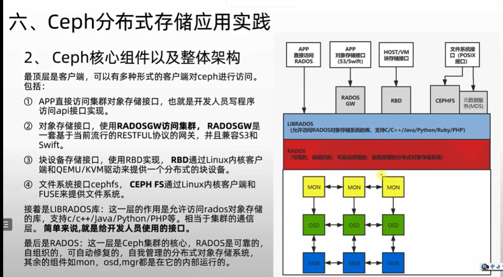

## 2、RADOS作用


## 3、mon组件

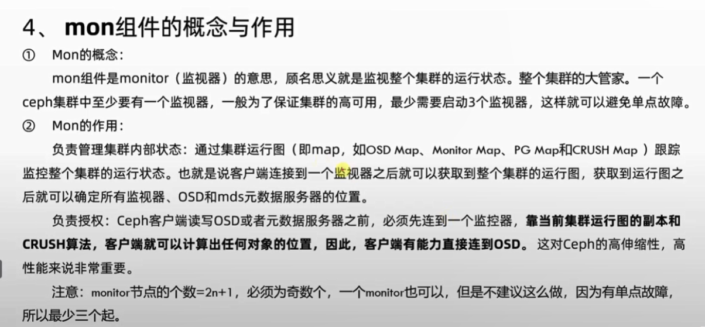

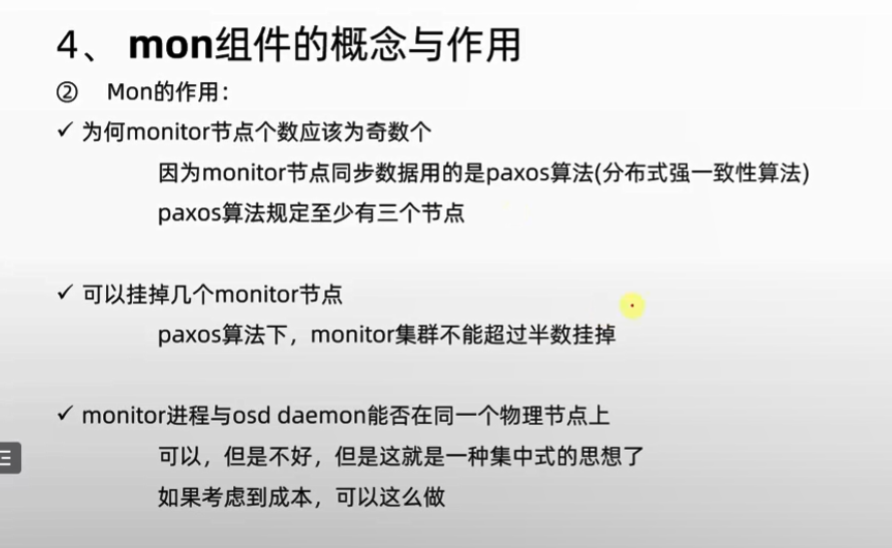

## 4、OSD组件

 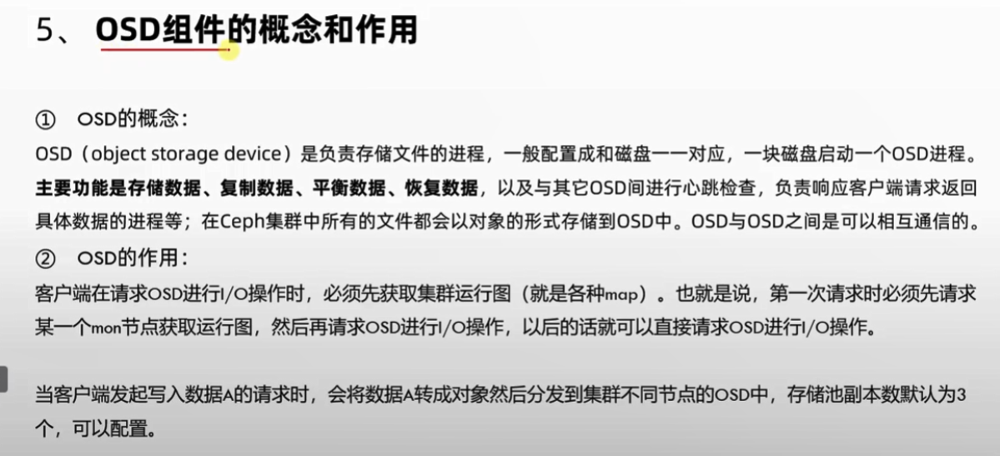

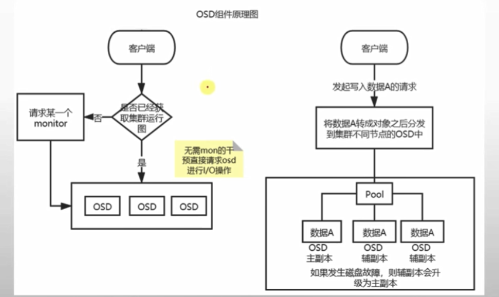

## 5、mgr、MDS、RGW组件

 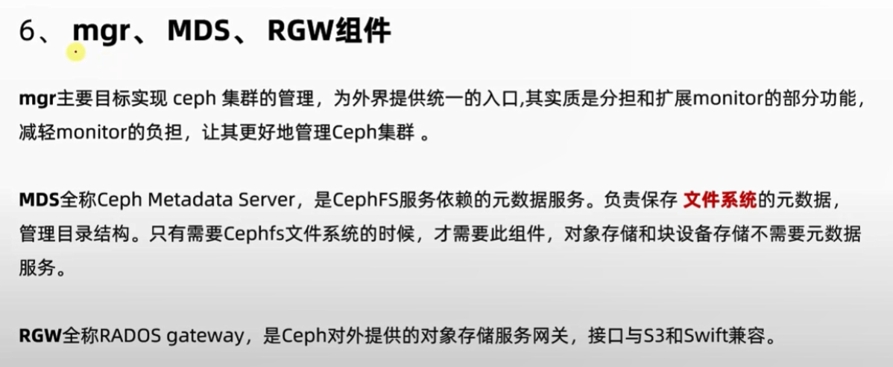

## 6、Pool

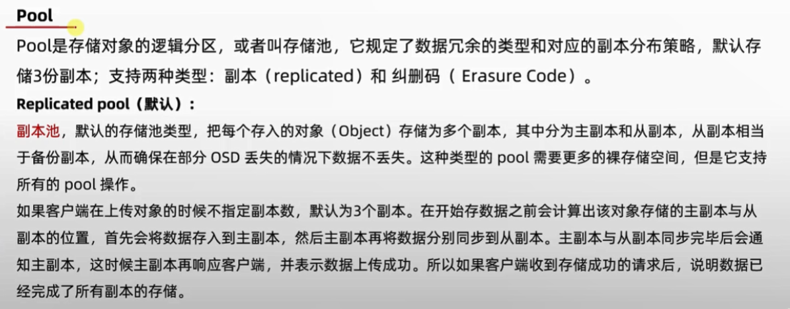

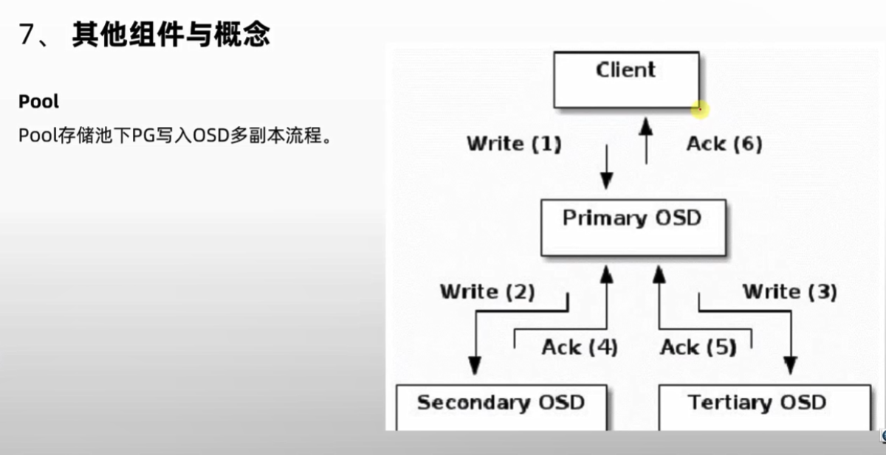


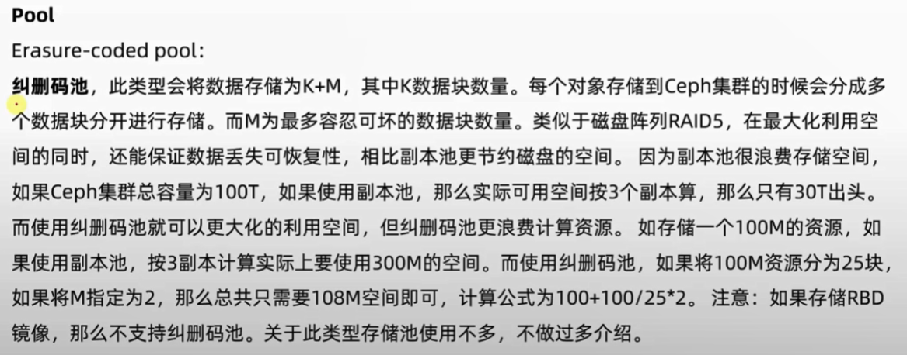

  

## 7、PG

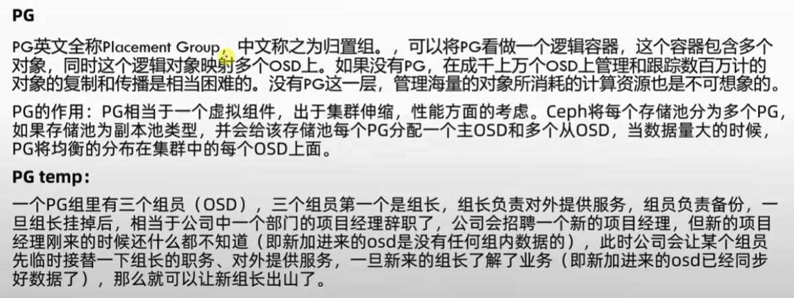

## 8、 PGP、Object

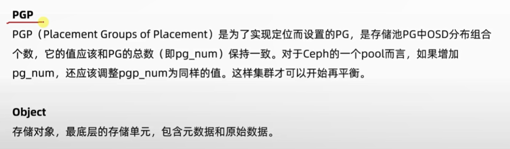


## 9、Pool、PG、Object、OSD之间关系

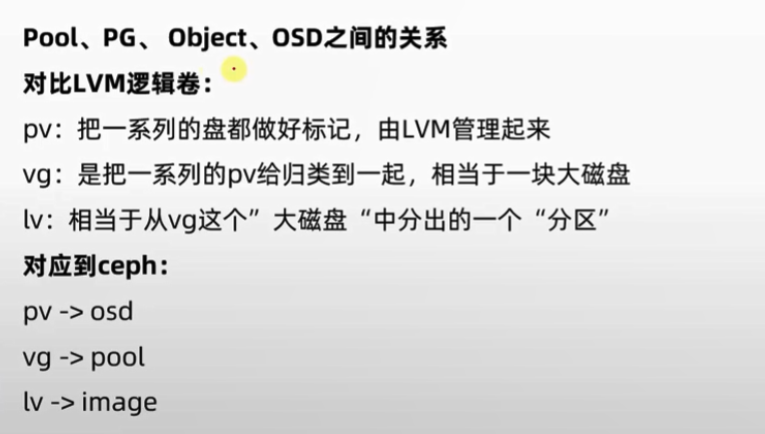

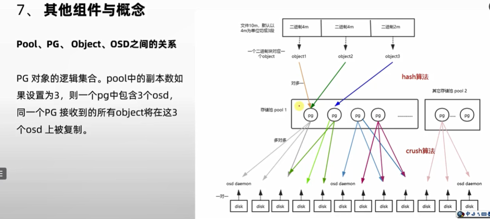

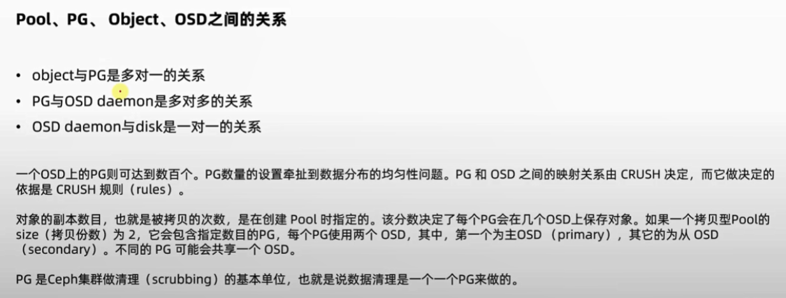

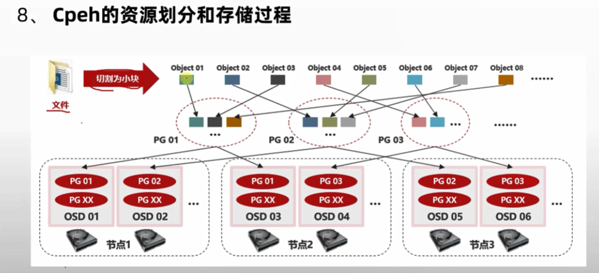


## 9、PG 数目确定

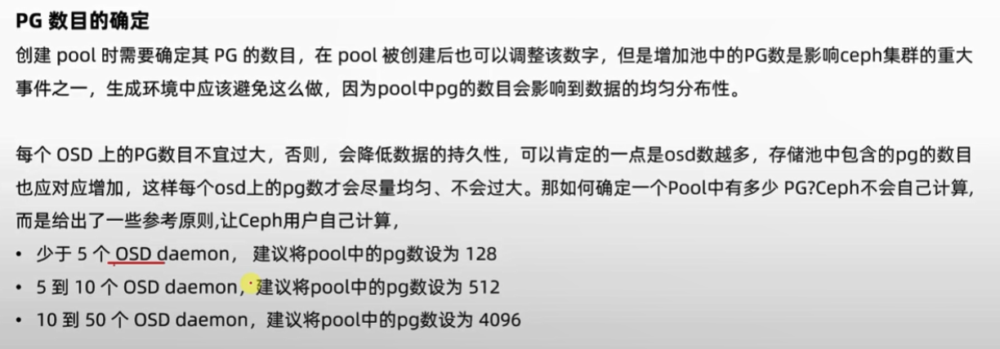

## 10、Ceph数据写入流程

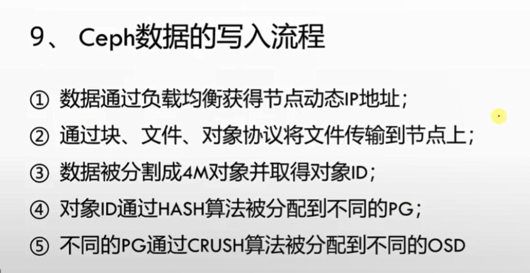

## 11、Ceph 网络

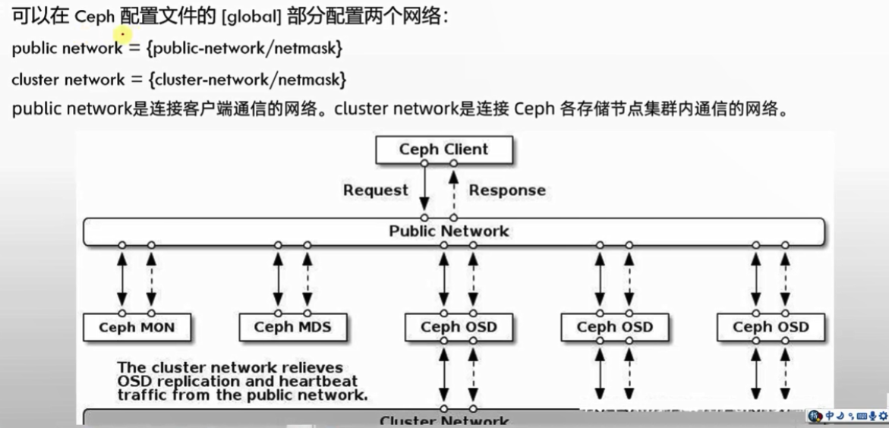


## 12、部署安装

### 1、环境准备

```bash
# 修改内核参数
vim /etc/sysctl.conf

# 最大进程数
kernel.pid_max = 4194303

# 减少 swap 使用
vm.swappiness = 10

# 文件句柄最大数
fs.file-max = 2097152

# TCP 网络优化
net.core.somaxconn = 65535
net.core.netdev_max_backlog = 16384
net.ipv4.tcp_max_syn_backlog = 16384
net.ipv4.tcp_fin_timeout = 30
net.ipv4.tcp_keepalive_time = 600
net.ipv4.tcp_tw_reuse = 1
net.ipv4.tcp_tw_recycle = 0
net.ipv4.ip_local_port_range = 1024 65535

# 生效
sysctl -p
```

```bash
# 配置时间同步

apt update
apt install chrony -y

vim /etc/chrony/chrony.conf

# 公网 NTP
server ntp.aliyun.com iburst
server ntp.tencent.com iburst
server time.cloudflare.com iburst
server time.google.com iburst

# RTC 同步
rtcsync

# 时间漂移文件
driftfile /var/lib/chrony/chrony.drift

# 允许大步时间校正
makestep 1.0 3

# 日志
logdir /var/log/chrony

systemctl restart chrony
systemctl enable chrony
```

```bash
# 每个节点关闭 swap
swapoff -a
sed -ri 's/.*swap.*/#&/' /etc/fstab
```

```bash
# 加载内核模块
cat >> /etc/modules-load.d/ceph.conf <<EOF
rbd
ceph
EOF
```

### 2、安装 Rook-Ceph

```bash
# 安装 CRD + Operator
git clone --single-branch --branch v1.15.0 https://github.com/rook/rook.git
cd rook/deploy/examples
kubectl create -f crds.yaml
kubectl create -f common.yaml
kubectl create -f operator.yaml

# 查看
kubectl -n rook-ceph get pod
```

